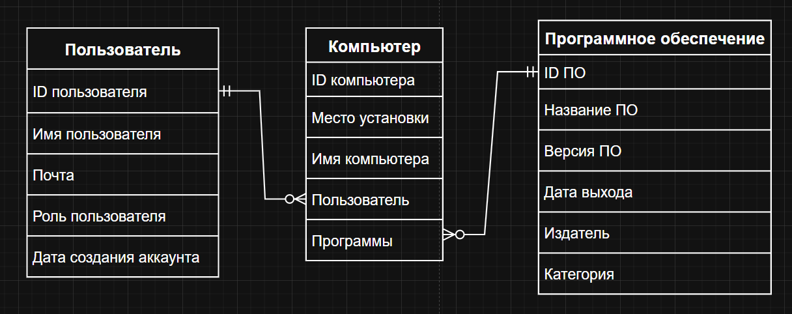

# LABAR /АРТЕМ КИТОВ ТОП/

### *Проект представляет собой программу, выполняющую учет ПО пользователей. Это нужно пользователям в качестве просмотра списка установленных приложений и более быстрого управления над ними.*

## Цели системы

•	Обеспечение быстрого доступа к информации об ПО пользователей;
•	Автоматизация процесса установки, проверки обновлений или удаления ПО  

## Архитектура

### Для проекта будет использована трехуровневая архитектура:  
*Presentation Layer*: CLI на Python  
*Business Logic Layer*: Запросы и макросы для обработки данных  
*Data Layer*: Database для хранения информации на SQLite  

## Функционал системы

*Для участника*  
• Регистрация в системе  
• Просмотр доступных обновлений  
• Установка и удаление доступного ПО из списка  

*Для администратора*  
• Управление списком ПО и доступных обновлений  
• Просмотр списка зарегистрированных пользователей  
• Просмотр списка установленного ПО пользователей  
• Отправка уведомлений о новых обновлениях ПО  
• Добавление ПО  
• Регистрация в системе  

## База данных

### База данных сделана на SQLite. Состоит из трех таблиц:
• Users (Пользователи)  
В таблице указаны сами пользователи: имена, почты, дата регистрации в системе, его права (роль) в системе.

• PCs (Компьютеры)  
В этой таблице указаны компьютеры пользователей: названия, пользователи, и установленные программы.  

• Programs (Программы/ПО)  
В этой таблице указана информация о программах: название, версия, издатель, дата релиза, категория.

## ER-диаграмма
